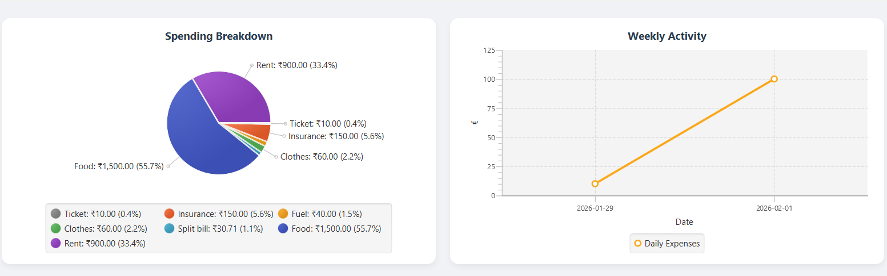

<div align="center">

# Expense Tracker

**A full-featured desktop expense management application built with JavaFX and MySQL**


[Features](#-features) • [Screenshots](#-screenshots) • [Tech Stack](#-tech-stack) • [Setup](#-setup) • [Usage](#-usage)

</div>

---

## About

Expense Tracker is a desktop application that helps you take full control of your personal finances. Built with JavaFX and backed by MySQL, it provides a clean, intuitive interface to log daily spending, manage recurring bills, track savings goals, and visualize where your money is going — all from your desktop.

Whether you're budgeting for the month or just trying to cut back on unnecessary spending, Expense Tracker gives you the clarity you need.

---

## Screenshots

> **Dashboard Overview**
> 
> 
> *Main dashboard showing monthly summary and recent transactions*

---

> **Expense Charts**
> 
> 
> *Pie, Line, and Bar charts for visual spending breakdowns*

---

> **Add / Edit Expense**
> 
> 
> *Simple form to log a new expense with category and date*

---

> **Savings Goals**
> 
> 
> *Set and track progress toward your financial goals*

---

> **Recurring Expenses**
> 
> 
> *Manage subscriptions and recurring monthly payments*

---

## Features

| Feature | Description |
|---|---|
| 📝 **Expense Management** | Add, edit, and delete expenses with categories and notes |
| 🔁 **Recurring Payments** | Track subscriptions and repeat bills automatically |
| 🎯 **Savings Goals** | Set goals with target amounts and monitor progress |
| 💰 **Income Tracking** | Update your monthly income to manage your budget |
| 🔍 **Search & Filter** | Find expenses by date, category, or keyword |
| 📊 **Visual Charts** | Pie, Line, and Bar charts for spending insights |
| 📤 **CSV Export** | Export your expense history to CSV for external use |

---

## Tech Stack

- **Language:** Java 17+
- **UI Framework:** JavaFX (FXML + CSS)
- **Database:** MySQL
- **Connectivity:** JDBC
- **Build Tool:** Maven / Gradle

---

## Setup

### Prerequisites

- Java 17 or higher
- JavaFX SDK
- MySQL Server
- Maven or Gradle

### 1. Clone the Repository

```bash
git clone https://github.com/Khushigajjar/Expense-Tracker
cd ExpenseTracker
```

### 2. Configure the Database

Create a MySQL database and run the schema:

```sql
CREATE DATABASE expense_tracker;
USE expense_tracker;
-- Then run the provided schema.sql file
```

Update your database credentials in `src/main/resources/config.properties`:

```properties
db.url=jdbc:mysql://localhost:3306/expense_tracker
db.username=your_username
db.password=your_password
```

### 3. Build and Run

```bash
# With Maven
mvn clean javafx:run

# With Gradle
gradle run
```

---

## Usage

1. **Launch** the application and set your monthly income
2. **Add expenses** using the "+" button — assign a category, amount, and date
3. **Set up recurring payments** under the Recurring tab
4. **Create savings goals** and track your progress over time
5. **View charts** on the Dashboard to analyze your spending habits
6. **Export** your data to CSV anytime from the File menu

---

## Project Structure

```
ExpenseTracker/
├── src/
│   ├── main/
│   │   ├── java/
│   │   │   └── com/expensetracker/
│   │   │       ├── controllers/
│   │   │       ├── models/
│   │   │       ├── dao/
│   │   │       └── utils/
│   │   └── resources/
│   │       ├── fxml/
│   │       ├── css/
│   │       └── config.properties
├── schema.sql
└── README.md
```

---


## 📄 License

This project is licensed under the MIT License — see the [LICENSE](LICENSE) file for details.

---

<div align="center">
Made with ☕ and Java
</div>